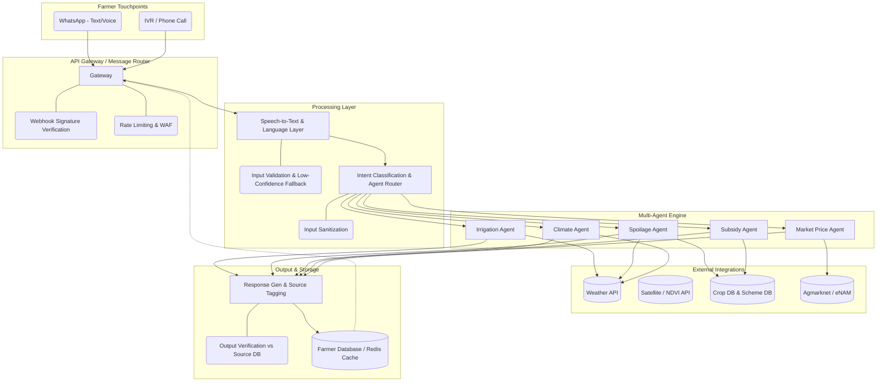

# KisanSaathi: "One Number, One Answer"

**Unified Farmer Advisory System** built for the *Yuva Yodha Energy Tech Hackathon by Schneider Electric — Challenge 01: Sustainable Agriculture*.

---

## 🌾 Overview

"One Number, One Answer" is a single WhatsApp/IVR-based advisory channel designed to give smallholder farmers instant, voice-first, vernacular answers to their most pressing daily questions. By targeting the adoption gap in digital agricultural services—primarily driven by literacy, connectivity, and trust barriers—this project delivers a highly accessible decision-support system without requiring a smartphone app, literacy, or a stable data connection.

Our goal is to **reduce energy and water waste**, **minimize post-harvest loss**, and **improve farmer productivity and affordability** through a multi-agent AI architecture.

## 🌟 Core Features (The Multi-Agent System)

Instead of a monolithic AI model, KisanSaathi utilizes specialized AI agents that own a single domain, pull from verified data sources, and return unambiguous instructions:

- 💧 **Irrigation Advisory Agent**: Analyzes weather/rainfall data and crop stages to recommend whether to skip or proceed with irrigation. This directly cuts wasted water and the pumping energy spent applying it.
- 🍅 **Spoilage Risk Agent**: Uses shelf-life tables combined with temperature and humidity trends to provide actionable Green (safe to store), Yellow (sell soon), or Red (sell immediately) alerts, minimizing post-harvest loss.
- 🌦️ **Climate Resilience Alerts**: Pushes proactive warnings for heat-stress, irregular rainfall, and frost risks to opted-in farmers.
- 📜 **Subsidy Scheme Navigator**: Matches farmer profiles against curated databases (PM-KISAN, PMFBY, KCC, etc.) to confirm eligibility and outline the immediate next steps to apply.
- 💰 **Market Price Verification**: Fetches live mandi prices (Agmarknet/eNAM) so farmers can verify if the prices offered by middlemen are fair and aligned with the current market and MSP.

## 🏗️ System Architecture

KisanSaathi leverages a robust, independent agent routing system with built-in security, authentication, and offline-resilience layers.



## 🔒 Security, Privacy & Trust

- **Source-Verified Outputs**: The system never hallucinates critical figures. Every subsidy or market price spoken to the farmer is verified against a source dataset.
- **Webhook Authentication**: Inbound WhatsApp webhooks are verified against Meta's `X-Hub-Signature-256` to prevent spoofed requests.
- **Untrusted Input Handling**: Transcribed text from voice notes is always treated as adversarial and fully sanitized before triggering database queries or generative prompts.
- **Transient Audio**: Voice notes are strictly used for transcription and deleted immediately following successful processing.
- **Offline Resilience**: Last-received advisories are cached locally/in Redis, ensuring farmers can retrieve guidance even during connectivity drops.

## 🛠️ Technology Stack

- **Primary Interface**: WhatsApp Business API (Cloud API, Meta), Twilio / Exotel (IVR Fallback)
- **Backend API**: Node.js / Python (FastAPI)
- **Database & Caching**: PostgreSQL (Farmer profiles, structured data), Redis (Response caching)
- **AI / Speech**: Bhashini / Google Cloud STT & TTS (Regional language support)
- **External Data Sources**: OpenWeather API / IMD, Agmarknet, curated Govt. Schemes DB.

## 🚀 Getting Started

### Prerequisites
- Docker & Docker Compose
- Python 3.11+
- API Keys for WhatsApp Business, Weather API, and ASR/TTS Services.

### Installation

1. **Clone the repository:**
   ```bash
   git clone https://github.com/Sonali-0x/KisanSaathi.git
   cd KisanSaathi
   ```

2. **Environment Configuration:**
   Copy the example environment file and add your credentials.
   ```bash
   cp .env.example .env
   ```

3. **Start the Infrastructure (Database & Cache):**
   ```bash
   docker-compose up -d
   ```

4. **Install Dependencies and Run the Server:**
   ```bash
   python -m venv .venv
   source .venv/bin/activate  # On Windows use: .venv\Scripts\Activate.ps1
   pip install -r requirements.txt
   uvicorn src.api.main:app --reload
   ```

## 📜 License
This project is licensed under the MIT License.