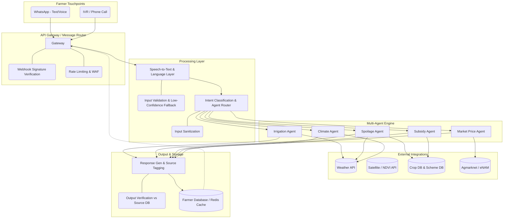

# KisanSaathi: "One Number, One Answer"

[](https://www.python.org/)
[](https://fastapi.tiangolo.com/)
[](https://www.postgresql.org/)
[](https://redis.io/)
[](https://opensource.org/licenses/MIT)

**Unified Farmer Advisory System** built for the *Yuva Yodha Energy Tech Hackathon by Schneider Electric — Challenge 01: Sustainable Agriculture*.

---

## 📖 Table of Contents
- [Overview](#-overview)
- [Core Features (Multi-Agent System)](#-core-features-multi-agent-system)
- [System Architecture](#-system-architecture)
- [Security, Privacy & Trust](#-security-privacy--trust)
- [Architecture Decisions](#-architecture-decisions)
- [API Endpoints & Payloads](#-api-endpoints--payloads)
- [Technology Stack](#-technology-stack)
- [Folder Structure](#-folder-structure)
- [Getting Started](#-getting-started)
- [License](#-license)

---

## 🌾 Overview

**"One Number, One Answer"** is a single WhatsApp/IVR-based advisory channel designed to give smallholder farmers instant, voice-first, vernacular answers to their most pressing daily questions. 

By targeting the adoption gap in digital agricultural services—primarily driven by literacy, connectivity, and trust barriers—this project delivers a highly accessible decision-support system without requiring a smartphone app, literacy, or a stable data connection.

Our goal is to **reduce energy and water waste**, **minimize post-harvest loss**, and **improve farmer productivity and affordability** through a multi-agent AI architecture.

---

## 🌟 Core Features (Multi-Agent System)

Instead of a monolithic AI model, KisanSaathi utilizes specialized AI agents that own a single domain, pull from verified data sources, and return unambiguous instructions:

| Agent | Description | Impact |
| :--- | :--- | :--- |
| 💧 **Irrigation** | Analyzes weather/rainfall data and crop stages to recommend whether to skip or proceed with irrigation. | Cuts wasted water and pumping energy. |
| 🍅 **Spoilage Risk** | Uses shelf-life tables combined with temperature and humidity trends to provide actionable alerts (Green/Yellow/Red). | Minimizes post-harvest loss. |
| 🌦️ **Climate** | Pushes proactive warnings for heat-stress, irregular rainfall, and frost risks to opted-in farmers. | Improves climate resilience. |
| 📜 **Subsidy** | Matches farmer profiles against curated databases (PM-KISAN, PMFBY, KCC, etc.) to confirm eligibility. | Boosts access to financial support. |
| 💰 **Market Price** | Fetches live mandi prices (Agmarknet/eNAM) so farmers can verify fair pricing against MSP. | Empowers fair trade and profitability. |

---

## 🏗️ System Architecture

KisanSaathi leverages a robust, independent agent routing system with built-in security, authentication, and offline-resilience layers.


```mermaid
flowchart TD
    subgraph Farmer Touchpoints
        A1(WhatsApp - Text/Voice)
        A2(IVR / Phone Call)
    end

    subgraph API Gateway / Message Router
        B[Gateway]
        B1(Webhook Signature Verification)
        B2(Rate Limiting & WAF)
        B --- B1
        B --- B2
    end

    subgraph Processing Layer
        C[Speech-to-Text & Language Layer]
        C1(Input Validation & Low-Confidence Fallback)
        C --- C1
        D[Intent Classification & Agent Router]
        D1(Input Sanitization)
        D --- D1
    end

    subgraph Multi-Agent Engine
        E1[Irrigation Agent]
        E2[Spoilage Agent]
        E3[Climate Agent]
        E4[Subsidy Agent]
        E5[Market Price Agent]
    end

    subgraph External Integrations
        F1[(Weather API)]
        F2[(Satellite / NDVI API)]
        F3[(Crop DB & Scheme DB)]
        F4[(Agmarknet / eNAM)]
    end
    
    subgraph Output & Storage
        G[Response Gen & Source Tagging]
        G1(Output Verification vs Source DB)
        G --- G1
        H[(Farmer Database / Redis Cache)]
    end

    A1 --> B
    A2 --> B
    B --> C
    C --> D
    
    D --> E1
    D --> E2
    D --> E3
    D --> E4
    D --> E5
    
    E1 --> F1
    E2 --> F1
    E2 --> F3
    E3 --> F1
    E4 --> F3
    E5 --> F4

    E1 --> G
    E2 --> G
    E3 --> G
    E4 --> G
    E5 --> G
    
    G --> H
    H -.-> B
```

---

## 🔒 Security, Privacy & Trust

- 🛡️ **Source-Verified Outputs**: The system never hallucinates critical figures. Every subsidy or market price spoken to the farmer is verified against a source dataset.
- 🔑 **Webhook Authentication**: Inbound WhatsApp webhooks are verified against Meta's `X-Hub-Signature-256` to prevent spoofed requests.
- 🛑 **Untrusted Input Handling**: Transcribed text from voice notes is always treated as adversarial and fully sanitized before triggering database queries or generative prompts.
- 🗑️ **Transient Audio**: Voice notes are strictly used for transcription and deleted immediately following successful processing.
- 📶 **Offline Resilience**: Last-received advisories are cached locally/in Redis, ensuring farmers can retrieve guidance even during connectivity drops.

---

## 🏗️ Architecture Decisions

1. **Agentic Router Model**: Instead of one monolithic LLM, we implemented an `IntentRouter` that classifies intent and delegates to specialized agents (`OnboardingAgent`, `IrrigationAgent`, `SpoilageAgent`, `SubsidyAgent`, `MarketPriceAgent`, `ClimateAgent`). This isolates prompt logic and limits hallucinations.
2. **Encryption at Rest**: The `FarmerProfileDB` utilizes a custom SQLAlchemy `TypeDecorator` combined with `cryptography.fernet` to symmetrically encrypt PII (like location and land size) directly at the application layer before it hits PostgreSQL.
3. **Offline Resilience**: A `RedisCache` layer intercepts successful agent responses. If an external API fails (like the Weather API), the router falls back to the cache to ensure the farmer still receives a response.
4. **Data Hygiene**: Voice notes are meant to be strictly ephemeral. To enforce this, we designed S3 lifecycle policies (`scripts/setup_s3_lifecycle.json`) to auto-delete objects after 1 day.
5. **Language Flexibility**: Instead of hardcoding all translations, we introduced a `TranslationClient` with a domain-specific `agri_glossary.json`. It attempts a translation API call and falls back to English if it fails, ensuring the system never crashes due to a language API outage.

---

## 🔌 API Endpoints & Payloads

The system relies on external webhooks from communication providers.

### 1. WhatsApp Webhook (`/webhook`)
Handles incoming messages from the Meta WhatsApp Cloud API.
- **Method**: `POST`
- **Security**: Validates the `X-Hub-Signature-256` HMAC header.
- **Payload Structure** (Simplified):
  ```json
  {
    "entry": [{
      "changes": [{
        "value": {
          "messages": [{
            "from": "919876543210",
            "id": "wamid.HBg...",
            "type": "text",
            "text": {"body": "will my crop spoil?"}
          }]
        }
      }]
    }]
  }
  ```

### 2. Twilio IVR Fallback (`/ivr/incoming` & `/ivr/process`)
Provides a voice-call alternative for feature-phone users.
- **Method**: `POST`
- **Payload Structure**: Standard `application/x-www-form-urlencoded` from Twilio containing `From` (Caller ID) and `SpeechResult` (Transcribed speech).
- **Response**: TwiML XML using the `<Say>` and `<Gather>` verbs.

---

## 🛠️ Technology Stack

- **Primary Interface**: WhatsApp Business API (Cloud API, Meta), Twilio / Exotel (IVR Fallback)
- **Backend API**: Python (FastAPI)
- **Database & Caching**: PostgreSQL (Farmer profiles, structured data), Redis (Response caching)
- **AI / Speech**: Bhashini / Google Cloud STT & TTS (Regional language support)
- **External Data Sources**: OpenWeather API / IMD, Agmarknet, curated Govt. Schemes DB.
- **Infrastructure**: Docker & Docker Compose

---

## 📁 Folder Structure

```text
KisanSaathi/
├── .github/                 # GitHub Actions & CI/CD workflows
├── data/                    # Local datasets and seeded DB structures
├── docs/                    # Additional architecture and API documentation
├── scripts/                 # Utility scripts (e.g., S3 lifecycle)
├── src/
│   ├── agents/              # Multi-agent AI logic (Irrigation, Market, Subsidy, etc.)
│   ├── api/                 # FastAPI routes (Webhook, IVR, Main)
│   ├── core/                # Core config, DB sessions, security, and cache
│   ├── integrations/        # 3rd party API integrations (WhatsApp, Weather, STT/TTS)
│   ├── models/              # Pydantic models & SQLAlchemy schemas
│   └── workers/             # Background task processing
├── tests/                   # Pytest suite
├── docker-compose.yml       # Infrastructure orchestration
├── requirements.txt         # Python dependencies
└── README.md                # Project documentation
```

---

## 🚀 Getting Started

### Prerequisites
- Docker & Docker Compose
- Python 3.11+
- API Keys for WhatsApp Business, Weather API, and ASR/TTS Services.

### Installation

1. **Clone the repository:**
   ```bash
   git clone https://github.com/Sonali-0x/KisanSaathi.git
   cd KisanSaathi
   ```

2. **Environment Configuration:**
   Copy the example environment file and add your credentials.
   ```bash
   cp .env.example .env
   ```

3. **Start the Infrastructure (Database & Cache):**
   ```bash
   docker-compose up -d
   ```

4. **Install Dependencies and Run the Server:**
   ```bash
   python -m venv .venv
   source .venv/bin/activate  # On Windows use: .venv\Scripts\Activate.ps1
   pip install -r requirements.txt
   uvicorn src.api.main:app --reload
   ```

---

## 📜 License
This project is licensed under the [MIT License](LICENSE).